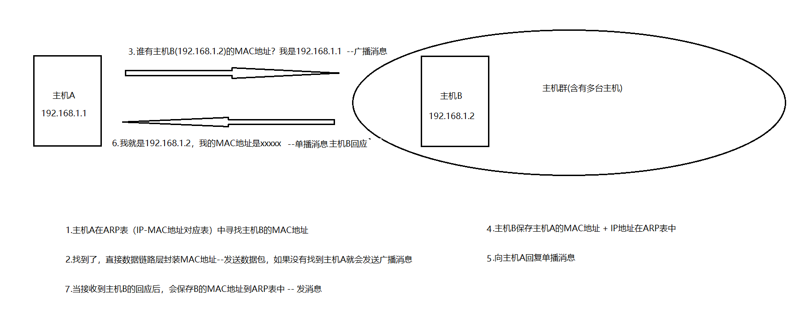
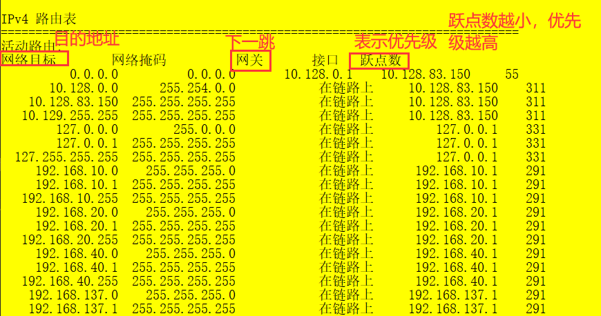

# 第四章

## 网络层提供的两种服务
    1. 网络层关注的是如何将分组从源端沿着网络路径送达目的端
    
    2. 在计算机通信中，可靠交付是由端系统负责的
    
    3. 两种服务：虚电路服务和数据报服务（现在互联网都用数据报服务）
        <1> 虚电路服务：表示这只是一条逻辑上的连接，分组沿着逻辑连接传送数据，并不是真正建立一条物理连接（简单说也
                       就是在有多条物理连接下，指定某条连接用来传输数据）

        <2> 数据报服务：网络层向上只提供简单灵活的、无连接的、尽最大努力交付的数据报服务网络层在发送分组是不需要建
                       立连接。每一个分组（IP数据报）独立发送，与其前后的分组无关。（简单理解，数据报知道自己的目
                       的地是哪，怎么过去是由路由器来选择路线的）

## 网际协议 IP
    1. 网络互连的设备：中间设备又称中间系统或中继系统
        物理层中继系统：转发器（集线器）
        数据链路层中继系统：网桥或桥接器（交换机）
        网络层中继系统：路由器
        网络层以上的中继系统：网关（现在认为路由器的接口为网关）

    2. 虚拟互联网
        虚拟互联网络也就是逻辑互联网络，互联起来的各种物理网络的异构性本来是客观存在的，但是我们利用IP协议可以使这些性
        能各异的网络从用户看起来好像是一个统一的网络

        使用IP协议的虚拟互联网称为IP网

        网络层的协议：
            IP协议，ARP协议，ICMP协议（负责报告网络故障），IGMP协议
    
    3. IP地址
        <1> IP地址层次化：层次化IP地址将32位的IP地址分为网络ID和主机ID（现在路由器只找网段，不需要找到具体的某一台
                         计算机）
            
            * 网络地址：
                网络地址（网络号）唯一指定了每个网络。同一网络中的每台计算机都共享相同的网络地址，并用它作为自己IP地址
                的一部分。

        <2> IP地址的组成
            * IP地址 = 网络号 + 主机号

        <2> IP地址的分类：    
            IP地址有四个八位（二进制）
            A类地址：第一个八位：1-127      二进制第一位为0 （实际上为1-126,127为本地地址）  默认子网掩码（一个255）
            B类地址：第一个八位：128-191    二进制前面为10                                  默认子网掩码（两个255）
            C类地址：第一个八位：192-223    二进制前面为110                                 默认子网掩码（三个255）
            D类地址：第一个八位：224-240    二进制前面为1110
            E类地址：

        <3> 配置子网掩码是可以按table键（可以分辨是哪一类的地址）子网掩码与IP地址做与运算时，主机位归零

        <4> 特殊的地址：
            127.0.0.1 本地环回地址
            169.254.0.0 在连接到网络后，没有获取到的地址，将会得到的默认地址
            保留的私网地址：（不在互联网之内，内部私用网，不能远程连接）
            10.0.0.0
            172.16.0.0 - 172.31.0.0     保留32个B类地址
            192.168.0.0 - 192.168.255.0     保留256个C类地址

        <5> 子网掩码：
            是一种用来指明一个IP地址中哪些位标识的是主机所在的子网以及哪些位标识的是主机的位掩码。即划分网络部分和主机
            部分（子网掩码的作用）,当在发送数据时,如果通过子网掩码发现目标地址和源地址在同一个网段, 则直接将数据包找到
            指定的MAC地址发送,在同一个网段则通过路由转发。

            作用：用来标识子网，必须与IP地址一起存在

            组成：子网掩码与IP地址一样，是二进制表示也是由0和1组成，连续的1表示网络地址，连续的0表示主机地址，只有网络
                  地址相同的主机在同一个子网，才能直接通信

            利用子网掩码求网段：
                如果IP地址为192.168.10.204，那么其子网掩码为255.255.255.0，我们将两者进行二进制的与运算（两者都为true
                结果才为true），子网掩码的网络部分都为1，主机部分都会归0，当与IP地址进行与运算时，网络部分得到的就是IP
                的网络部分，而主机部分归零即可，那么该网段就是192.168.10.0

            注意：IP地址的主机部分不能全为0，这代表一个网段，也不能全为1，这是个广播
        
        <6> 子网划分：
            举例：将IP为192.168.0.0，子网掩码为255.255.255.0分为两个网段
                1. 将原来的网段等分为2部分。也就是说一部分（第一个子网）地址范围为1-126，一部分（第二个子网）范围为129
                   到254之间

                2. 将子网掩码向后移动一位（向网络部分移动1位）。也就是说划分的子网的的子网掩码为255.255.255.128 

                    注意: 
                        1.网关地址一般使用网段中的第一个地址，那么第一个子网的网关为192.168.0.1，第二个子网的网关为
                          192.168.0.129

                        2.等分数值（网段）的前一个地址为广播地址。也就是说，若分成4个子网，第一个的广播地址为：
                          192.168.0.63，第二个的广播地址为192.168.127，。。。

                        3.点到点的子网掩码为252。   

                        4.划分子网需要遵循/2的规律 

                合并网段：向左移动1位子网掩码可以合并（0,1）也可以合并（2,3）但是不能合并（1,2），移动两位可以合并（0,
                         1,2,3）和（4,5,6,7），移动3位可以合并（0,1,2,3,4,5,6,7,）

            
        <7> 数据包转发过程，MAC地址与IP地址
            总而言之，IP地址决定了数据包最终要到哪一个计算机（决定数据包的起点和终点），MAC地址决定了下一站通过哪里
            （将数据包转给哪个中转点）

        <8> IPv4数据报格式：首部（固定部分+可选字段） + 数据部分
            固定部分：
                版本：标明是IPV4还是IPV6
                首部长度：由固定部分+可选字段的长度
                区分服务：数据包传送的优先级
                总长度：首部 + 数据部分的长度（数据报的总长度）
                标识：一个计数器, 每产生一个数据包就加1, 不是序号, 如果一个数据包分片, 那么它们的标识是一样的
                标志：表名这个数据包是否是分片的(有些数据包太大, 则将其再细分为几个小包, 每个包都有首部)
                片偏移：分片后每一个包相对于起始包的偏移量(字节数/8)
                TTL（数据包首部生存时间）:原始值为128，每经过一个路由器就会-1
                协议：指明数据部分的协议, 是一个数字（代表协议）, 如：TCP协议（6）, UDP协议（17）
                首部检验和：用于检查首部信息是否出现错误
                源地址：发送方的IP地址
                目的地址：接收方的IP地址

            可变部分：是一个选项字段，用来支持排错，测量以及安全等措施（1到40字节）可变部分增加路由器的工作（需要检查
                     多长）

                注意：通过ping IP地址 -i 数字(1,2,3),可以直到数据报传输依次经过的网段（通过查看TTL确定总共经过几个路
                      由器）

            数据路由：路由器在不同网段转发数据包

            网络畅通的条件：能去能回（即沿途路由器必须知道目标网络下一跳给哪个接口，必须知道源网络下一跳给哪个接口）

            静态路由：对于不是直连的网段，必须告诉路由器到目标网络的所有接口

            配置路由器：
                进入特权模式：en
                显示路由：#show ip route
                添加路由表：#ip route 本网段 子网掩码 下一跳需要添加的网段
                删除路由表：# no ip route 本网段 子网掩码 下一跳需要添加的网段

            网管就是默认路由（计算机网卡不能加两个网关，相当于有两条默认路由）

        <9> cmd命令：
            route  print： 显示路由表
            netstat -r ：显示路由表
            route add IP mask 子网掩码 吓一跳网段：添加路由
            如何将cmd命令窗口中的内容输出到文件上：在命令后面加上 >c\文件名.txt
            注意windows中所有cmd命令后加上/?都会有提示。
            ping：用来测试连个主机之间的连通性
            pathping：能够检查出传输的路径（跟踪数据包路径）
            netstat -n:可以查看建立的会话(目标端口和源端口)
                    
## 地址解析协议ARP协议
    1. arp欺骗实现原理：
        假如有A,B,C,D,E 5台计算机，其中E为一台有抓包工具的计算机(实现ARP欺骗的计算机)，当A,B,C,D之间进行数据传输时，
        是通过MAC地址来确定对方的，E会先告诉它们一个假的MAC地址（E的MAC地址），那么它们丢弃正确的地址，当它们发送数
        据时会先经过E计算机，E再发送给接收方。这就实现了ARP欺骗。
                    
        一般的黑客软件都是通过arp欺骗来实现的，软件会告诉计算机一个假的MAC地址。
    
    2. arp命令：
        arp -a ：自动在缓存中读取IP地址和MAC地址的对应表关系(查看arp表)
        arp -s ：手动输入一条ARP项目，格式为 ： arp -a IP地址 MAC地址（修改ip地址所在 的MAC地址）
        arp -d ：删除所有arp

    3. ARP协议：地址解析协议(Address Resolution Protocol)，实现通过对方的IP地址(域名)寻找对方的MAC地址

    4. ARP协议的工作原理

    5. ARP协议抓包
    

## 网际控制报文协议ICMP
    1. ICMP允许主机或路由器报告差错情况和提供有关异常情况的报告

    2. ICMP的报文格式：首部 数据部分（类型 代码 检验和）

    3. ICMP的报文类型：
        ICMP差错报告报文：终点不可到达，源点抑制，时间超过，参数问题，改变路由（重定向）
        ICMP询问报文：回送请求和回答报文，时间戳请求和回答报文

## 因特网的路由选择协议
    1. 路由协议
        路由协议(Routing Protocol):指数据包转送方式的网上协议

    2. 静态路由

    3. 动态路由协议：
        <1> RIP协议：互联网上最早的动态路由协议，周期性广播，每隔30秒发一次广播，通过跳数判断最佳路径（跳数越少越优）
            
            缺点：带宽问题的限制

            概念: 是一种分布式的基于距离向量的路由选择协议，优点是简单，跳数最多包含15个路由器所以距离为16则表示
                    网络不可达。其应用层协议, 使用UDP传送数据
            
            特点：
                <1> 和谁交换信息？RIP协议仅和相邻路由器交换信息    

                <2> 交换什么？路由器交换的信息是自己的路由表

                <3> 多久交换？每30秒交换一次路由信息, 然后路由器根据新信息更新路由表。若超过180s没收到邻居路由器的
                             通告则判定邻居没了，并更新自己路由表
            
            配置动态路由：
                router rip 
                network（后面写几个八位（ip地址4个8位）：A类地址1个，B类2个，C类3个）
        
        <2> OSPF协议: 所有路由器掌握完整的网络拓扑和链路费用信息,度量值是带宽(哪带宽高就走哪)  支持多区域 触发式更新 
            
            特点:
                <1> 和谁交换信息？使用洪泛法向自治系统内所有路由器发送信息，即路由器通过输出端口向所有相邻的路由器
                    发送信息，而每一个相邻路由器又再次将此信息发往其所有的相邻路由器,类似于广播的形式
                
                <2> 交换什么？发送的信息就是与本路由器相邻的所有路由器的链路状态(本路由器和哪些路由器相邻以及该链
                             路的度量/代价---距离、时延等)
                
                <3> 多久交换？只有当链路状态发生变化时，路由器才向所有路由器洪泛发送此信息

        <3> BGP协议(外部网关协议):BGP是不同自治系统的路由器之间交换路由信息的协议
            
            特点:                 
                <1> 和谁交换信息？与其它AS邻站的BGP发言人(边界路由)交换信息

                <2> 交换什么？ 交换的网络可达性的信息, 即当前AS可以到达哪些AS

                <3> 多久交换？ 发生变化时更新有变化的部分

    4. cmd命令
        route print：打印路由表信息

    5. 路由表信息解读

## VPN虚拟专用网
            
## NAT网络地址转换(端口映射技术)
    1. 路由器对目的地址是私有IP地址的数据报一律不进行转发, 而大部分的局域网内使用的都是私网地址
    
    2. NAT(理解):(也就是能够使我们多台计算机访问一个IP地址)
        假如有两个网,一个私有局域网,一个是Internet(外网),它们是通过一个公网地址(至少有一个公网地址)来与互联网进行
        交互的,而这个公网地址所在的路由器则必须为一个NAT路由器(安装了NAT软件的路由器),正常情况下,外网是不能访问内
        网的,但是内网访问外网经过该路由器时,NAT路由器就会将源IP(内网IP)转换为公网IP,然后将端口号进行转换,然后访问
        外网,当外网返回时,则会找到原来的IP和端口,然后将IP和端口都转换为该信息内的IP和端口, 再通过IP找到内网主机通
        过端口通过端口找到应用程序 
            
            PAT(能够替换端口地址)

            NAT(一个公网地址只能对应一个内网地址的访问)
                
## IP数据报的三种传输方式
    1. 单播:
        单播用于发送数据包到单个目的地,且每发送一份单播报文都是用一个
        单播IP地址作为目的地址,是一种点对点的传输方式
    
    2. 广播:
        广播是指发送数据包到同一广播获取子网内所有设备的一种传输方式,是一种单点对多点的传输方式
    
    3. 组播(多播):
        当网络中的某些用户需要特定数据时, 组播数据发送者仅发送一次数据, 借助组播路由协议为组播数据包建立组播分发树, 
        被传递的数据到达用户端尽可能近的节点后才开始复制和分发, 是一种单点对多点传输方式。需要组播路由器的支持(运行
        组播协议的路由器)

    4. IP组播
        IP组播地址范围：224.0.0.0-239.255.255.255(D类地址), 一个D类地址表示一个组播组, 
               只能用作分组的目标地址。源地址总是单播地址
        注意：
            <1> 组播数据报也是“尽最大努力交付”，不提供可靠交付，应用于UDP
            <2> 对组播数据报不产生ICMP差错报文
            <3> 并非所有D类地址都可以作为组播地址

        因特网范围内组播
            IGMP协议：让路由器知道本局域网上是否有主机(的进程)参加或者退出了某个组播组
            组播路由选择协议：目的是找出以源主机为根节点的组播转发树

        硬件组播         
            同单播地址一样，组播IP地址也需要相应的组播MAC地址在本地网络中实际传送帧。
            组播MAC地址以十六进制值01-00-5E, 余下的6个十六进制位是根据IP组播组地址的最后23位转换得到的
            TCP/IP协议使用的以太网多播地址的范围是：01-00-5E-00-00-00到01-00-5E-7F-FF-FF
            收到多播数据包的主机，还要在IP层利用软件进行过滤，把不是本主机要接收的数据包丢弃

