# 第五章

## 传输层两个协议
    1. TCP:
        基于可靠传输(数据丢失之后要求重新传送)
        分段 编号 流量控制 建立会话
        应用场景:
            如:qq传文件,访问网站
    
    2. UDP:
        基于不可靠传输
        一个数据包就能完成数据通信(不编号(一个数据完成传输),不建立会话)
        应用场景:
            如:qq聊天,多播

    3. TCP与UDP的区别
        <1> TCP是面向连接的，有三次握手和四次挥手过程，而UDP不是面向连接的

        <2> TCP是有可靠的连接机制，UDP没有连接和确认机制，会丢包，会出错，不可靠的协议

        <3> TCP数据量很大，防止丢包，正确重传，对数据准确性很关心，UDP数据量小

        <4> TCP速度慢，效率低，UDP速度快，效率高

## 传输层和应用层之间的关系
    http协议 = TCP协议 + 80端口
    HTTPS协议 = TCP协议 + 443端口
    FTP协议 = TCP协议 + 21端口
    SMTP协议(发送邮件) = TCP协议 + 25端口
    POP3协议(接收邮件) = TCP协议 + 110端口
    RDP协议 = TCP协议 + 3389端口
    共享文件夹 = TCP协议 + 445端口
    SQL = TCP协议 + 1433端口
    DNS = UDP + 53端口 or TCP协议 + 53端口

## 应用层协议和服务之间的关系
    服务运行后在TCP或UDP的某个端口侦听客户端请求(IP地址指向计算机(服务器),端口号指向服务(对外提供的服务))

## 相关概念
    1. 两个对等运输实体在通信时传送的数据单位叫做运输协议数据单元(Transport Protocol Data Unit)

    2. TCP传送的协议数据单元是TCP报文段,UDP传送的协议数据单元是UDP报文或用户数据报

    3. UDP 在传送数据之前不需要建立连接,对方的运输层在收到UDP报文后,不需要任何确认,提供不可靠交付,但是在某些情况下
       UDP是一种最有效的工作方式

    4. TCP是提供面向连接的服务.不提供广播或多播服务.是可靠的,面向连接的服务,会增加许多开销,使协议数据单元首部增加,
       同时还占用许多处理机资源

## UDP协议
    1. 特点：
        <1> UDP协议是面向无连接的协议,在发送数据之前不需要建立连接

        <2> UDP使用最大努力交付, 即不可靠交付

        <3> UDP协议无拥塞控制, 适合很多实时应用, 如多播,适合多媒体通信要求

        <4> UDP协议是面向报文的协议, 直接将应用层传过来的数据进行封装成用户数据报,然后往网络层传输, 所以应用层传过来
            的数据的大小需要在一定范围内, UDP协议不能对数据进行分段

        <5> 支持一对一,一对多,多对一和多对多的交互通信

        <6> 传输速度比TCP快，但是传输的数据量小

    2.UDP协议的头部组成结构

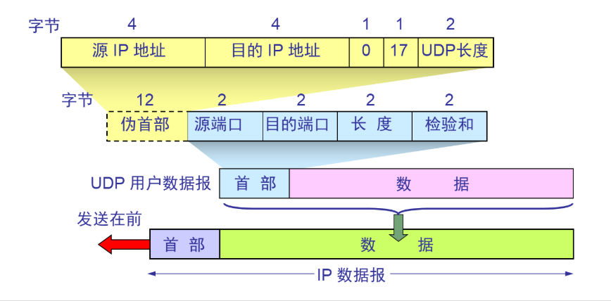
        
    3. 首部格式：源端口 目标端口 长度(整个用户数据报的大小) 检验和(对整个数据报进行检验)

    4. 注意:UDP在IP数据服务的基础上只增加了端口和差错检测功能

    5. 什么场景使用UDP
        <1> 不需要可靠机制，只要求速度(如：流媒体，多媒体游戏，IP电话)
        
        <2> 资源消耗特别小

        <3> 基于UDP协议使用的协议
            * DNS，SNMP，DHCP（动态获取ip），RIP协议(动态路由协议之一)

    6. 抓包分析UDP协议(直接ping百度，使用DNS)

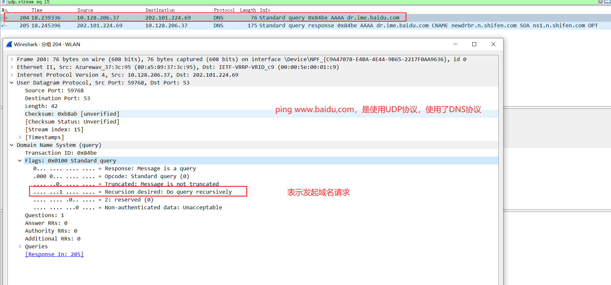

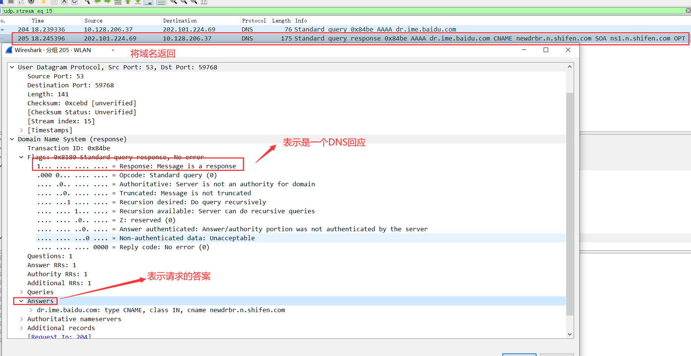

## TCP协议(传输控制协议)
### 特点:
    <1> TCP是面向连接的传输层协议
    <2> 每一条TCP连接只能有两个断点,每条TCP连接只能是点对点的(一对一)
    <3> TCP提供可靠交付服务(可靠传输)
    <4> TCP提供全双工通信
    <5> 面向字节流
    <6> 传输速度比UDP慢，但是传输数据量大

    套接字(socket):ip地址 + 端口号
    每一条TCP连接唯一的被通信两端的两个端点(套接字)所确定

### TCP报文段的首部格式:首部最长是60个字节

    1. TCP协议头部组成结构

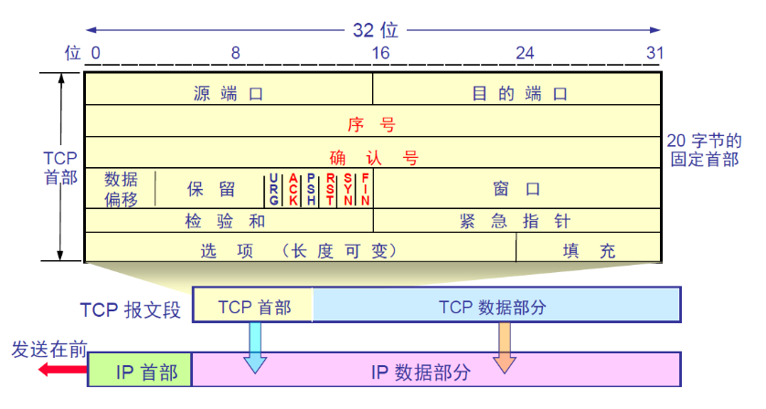

    2. 固定部分:
        源端口:表示发送方的端口,2个字节

        目标端口:表示接收方端口,2个字节

        序号:就是指TCP数据部分的第一个字节是整个TCP报文段的第几个字节,4个字节

        确认号:就是指接收数据最后一个字节+1,即告诉发送方下一次从哪一个字节发送,4个字节

        数据偏移:用于记录报文段,从第几个字节开始就是数据部分,即用来区分数据部分和首部

        保留:保留位,没有用

        URG(urgent):表示数据比较紧急,如果标记为1,那么,在传输数据时就不用排队

        ACK:如果为0,那么,确认号无效,如果为1确认号才有效

        SYN(sychronous):同步位,同步时使用(请求建立会话),用于发起连接

        PSH(push):表示在接收数据时,这个数据包优先接收

        RST(reset):如果为1,那么说明建立的会话出现严重问题,消息需要释放连接

        FIN(final):结束位,完成数据传输后释放连接就为1

        窗口:表示该数据报的发送方的接收窗口的容量, 用于告诉发送方发送窗口的最大值为该窗口的值(最大的原因是在拥塞
                控制时, 可能发送窗口小于该值) 占2个字节
            
            注意:存在于TCP缓存(双方的接收缓存和发送缓存)

        校验和:整个TCP报文段的校验和

        紧急指针:只有在URG值为1时,紧急指针才起作用,指明在数据包中的紧急部分有多少字节

    3. 可变部分:一般选项部分在进行SYN同步时才会出现, 比如MSS, WS等
        选项:最多40个字节,60-20,占8个字节

            MSS(Maximum Segment Size): 最大传输报文段(数据部分), 只有在建立连接SYN同步时才会出现, 发送方用于告
                                        知接收方其报文段的最大字节数
                                        (可以规定最大数据报的长度为多少)

            SACK:选择性确认,假如A向B发送数据,以滑动窗口技术传输时(数据12345678),如果数据丢失(456),78收到(收到不
                    连续数据块),那么B会进行选择性确认,告诉A:456数据没有接收到,那么A就会重新发送456

            时间戳选项：用于计算往返时间RTT
            
            NOP(no option): 无意义选项   

        填充(筹够4个字节的整数倍填充数据报)

### TCP协议如何实现可靠传输:
    1. 停止等待协议:在发送方收到接收方确认后才会继续发送下一个数据包(效率低)
    
        假如 A和B传输数据(通过TCP) A向B在传输,如果出现数据丢失,如果B没有确认收到(接收方需要想发送方确认收到数据包),
        那么A就会重新传输(即超时重传)

        TCP传输的情况:
            无差错传输:A发送数据报给B,得到B的确认后,A会发送下一个数据报

            超时传送:当B接收到有差错的报文时,会直接丢弃,即不会给A确认,那么A在等待一个传送来回时间(RTT时间)后就会重
                    新发送一份数据

            确认丢失:B的确认消息丢失了(A没有接收),那么A会重新发送一份数据,但是B会将重复的数据丢弃

            确认迟到:B的确认消息延迟好久到达,B将会重复的数据丢弃,当A收到延迟的确认后同时A什么都不做(不会在此传送该
                    数据)注意,在此之前A已经收到了B的第二次确认(A第二次发送该数据的确认)

        流水线传输:发送方可连续发送多个分组,不必每发完一个分组就停下来等待对方的确认,即不间断的传输数据包,可以提高
                    信道利用率

        窗口技术:实现连续发送数据报功能

        累积确认:通俗的讲,就是不需要逐一确认,当接收方收到连续的数据包时(如:1,2,3),那么接收方直接发送一个3的确认消息
                优点：容易实现，信道利用率提高了
                缺点：不能向发送方反应出接收方已经正确收到的所有分组的信息(利用SACK选择确认来避免)

    2. TCP滑动窗口技术实现可靠传输(重点)
        <1> 以字节为单位的滑动窗口技术
            实现:
                发送窗口:
                假如有A,B两个计算机在进行数据交互,假定A向B发送数据,且数据为n个字节,在A的发送缓存中有一个能存储20字
                节的发送窗口,B的接收缓存中也有一个能接收20个字节的接收窗口,当A向B发送数据时,在A的发送窗口中会有数据
                (20个字节)按不等的长度的数据(如第一次发送:1,2,3字节,第二次发送4,5,6,7字节)向B发送,如果第一次发送的
                字节得到确认,那么发送窗口就会向后面的字节移动3个(即21,22,23进入到发送窗口)(依此类推),

                接收窗口:
                当确认收到1,2,3字节后,B的接收窗口也会移动(应用程序可以读取接收到的字节,那么接收窗口就会抛弃1,2,3字
                节),只要确认收到就会移动(接收新的字节)

            当数据丢失时,如何实现可靠传输:
                假如B收到了1,2,3,4,5,6,10,11,12字节,那么B就会进行选择性确认(SACK),确认收到前面连续的字节(发送确认
                号4)的同时,也会通过SACK确认11,12,13,那么A只会发送丢失部分(7,8,9字节)
    
        <2> 超时重传时间选择
            加权平均往返时间RTTs: 指的是多个数据包(例如10个)的往返时间RTT的平均值不能老用旧的平均往返时间：所以需要
            不停的更新

        <3> TCP滑动窗口的示意图
        
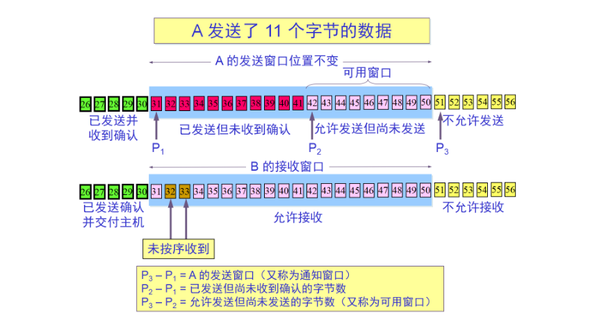

### TCP的流量控制:
    接收端通过动态的调整接收窗口的大小来实现流量控制, 发送端的发送窗口因为要同步接收端的接收窗口所以当接收窗口为
    0时, 发送方也发送不了数据了

### TCP的拥塞控制:
    1.概述
        * 出现拥塞控制的条件:
            对资源需求的总和大于可用资源(如一条网线50M,传输的数据总和大于50M)
        
        * 拥塞控制是一个全局性的过程, 涉及到所有的主机、所有的路由器, 以及与降低网络传输性能有关的所有因素

        * 拥塞控制的优点:
            可以避免出现死锁(吞吐量为0)

        * 无拥塞控制:当吞吐量达到最高的时候,如果继续增加数据报,那么会导致拥塞,最后可能导致死锁(吞吐量为0)

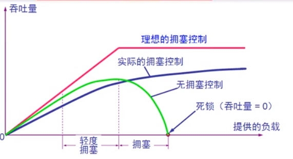
    
    2. 拥塞控制的实现
        * 发送方维持拥塞窗口cwnd
        * 发送方控制拥塞窗口的原则:
            1. 只要网络没有出现拥塞,拥塞窗口就会增大,以便于把更多的分组发送出去
            2. 只要网络出现拥塞,拥塞窗口就减小一些,以减少注入到网络中的分组
            
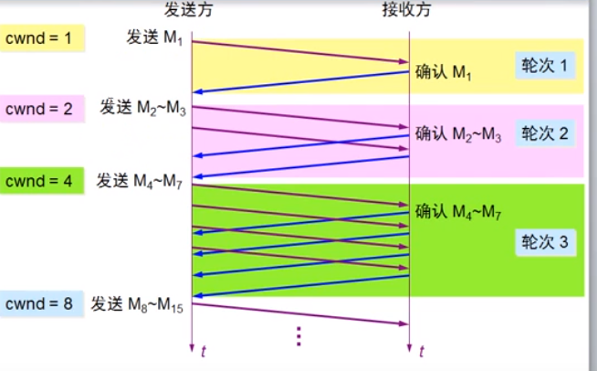
    
    3.慢开始算法的原理
        * 概述:
            在开始的时候,发送一个数据包,如果能接受就发送2个,还能接收,然后就发送4个,以此类推,每次乘以2
        * 慢开始门限(ssehresh) 
            1. 当cwnd < ssehresh时,开始使用慢算法,当前者>后者时,停止使用慢算法,而使用拥塞避免算法,当它们相等时,
               既可以使用慢算法,也可以使用拥塞算法

            2. 无论是在慢开始阶段还是在拥塞避免阶段,只要发送方判断网络出现拥塞(其根据就是看是否有收到确认,也就是有无
               丢包),就要把慢开始门限设置为出现拥塞时发送窗口值的一半(但是不能小于2),然后把拥塞窗口重新设置为1,执行
               慢开始算法(好处:有利于减少发送到网络中的分组数,使得路由器有充分时间可以处理积压的分组)

            3. 开始时,呈现指数增长,到达慢开始门限后呈现线性增长(+1),出现丢包后,会设置新的开始门限(原来的/2)并且拥塞
               窗口设置为1,继续执行慢开始算法

            4. 拥塞避免并非完全避免了拥塞,而是说在拥塞避免阶段把拥塞窗口设置为线性增长,使网络不容易出现拥塞

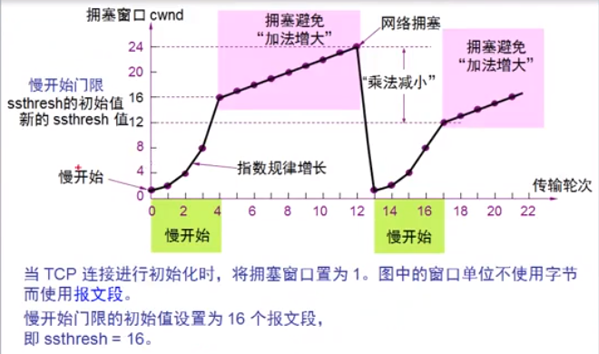

    4. 快重传和快恢复
        * 概述 
            快重传:
                    A,B进行数据交互,正常情况A发送5个数据包(1,2,3,4,5),B接收5个直接确认,在丢失情况下(A接收到
                    1,2,4,5)那么,B会只确认前两个,而A则需要重新发送3,4,5,而快重传则是指B直接给3个确认(只有3是
                    丢失的,三个确认号都是3),A只需要重发3即可

            快恢复:(相对于慢开始而言)
                    拥塞窗口不会从1开始而是直接进入到慢开始门限开始(即直接进入拥塞避免算法,线性增长)

            注意:慢开始是从1开始先进行指数增长,然后线性增长,而快恢复则是直接进入到线性增长
            
    5. 发送窗口的实际值
        发送方的发送窗口的上限值应当取为接收方窗口和拥塞窗口中较小的那个,即发送窗口的上限值:MIN[rwnd,cwnd]
        
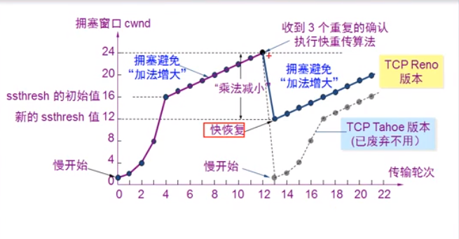

### TCP的传输连接(重点)
    1. 传输连接有三个阶段:连接建立,连接传送和连接释放
    
    2. TCP连接建立的都是采用客户服务器方式

    3. 主动发起连接建立的应用进程叫客户(client),被动等待连接建立的进程叫做服务器(server)

### 三次握手建立TCP连接
    1. 如何实现:
        假如A是客户端B是服务器,A向B发送一个请求(这必须是一个同步的数据包),这个数据报的内容是SYN=1,ACK=0,seq=x
        (这就说明这是一个主动发起连接的数据包)那么,B计算机就必须响应客户端,B计算机会发送一个内容为(SYN=1,ACK=1,
        seq=y,ack=x+1)的数据包给A计算机,在此之后A计算机还必须给B计算机发送数据内容为(ACK=1,seq=x+1,ack=y+1)的
        数据包,自此三次握手就完成了

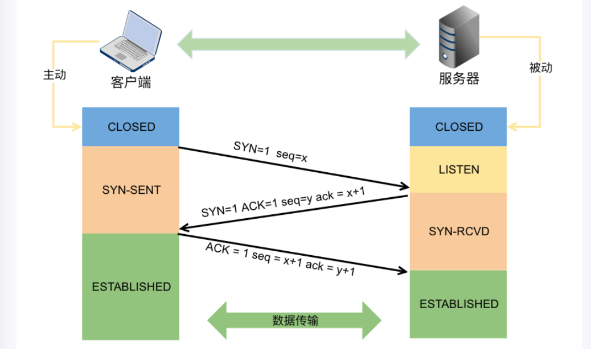

    2. 问题:为什么会有第三次的再次确认?
        假如A计算机向B计算机发送了一个请求(走远路),然后A计算机会再次发送一个请求给B请求建立联系(这个请求较快到达),
        此时B就直接响应A的第二个请求,那么过会第一个请求到达B,B会向A再次发送确认,而A的请求已经得到了确认,那么就不会
        再搭理B计算机,这就造成了B计算机的资源浪费,所以说,A计算机再次给B一个确认,就可以解决这个问题

    3. 三次握手双方的状态
        A计算机和B计算机在最开始都是处于CLOSED,当A向B发送请求之后(A处于SYN-SENT状态),B接收到后给A一个确认之后
        (B处于SYN-RCVD),A收到确认后(A处于ESTAB-LISHED),当B再次接受到A的确认之后(B就处于ESTAB-LISHED)  

    4. 三次握手过程中可以携带数据吗
        第一次和第二次是不行的，第三次是可以携带的。如果第一次可以的话，那么同步报文段需要花费很多时间，和内存来处
        理这些报文段。而第三次的话，对客户端而言已经建立起连接，清除了接收，发送能力正常，处于established状态

    5. TCP三次握手的抓包分析
    
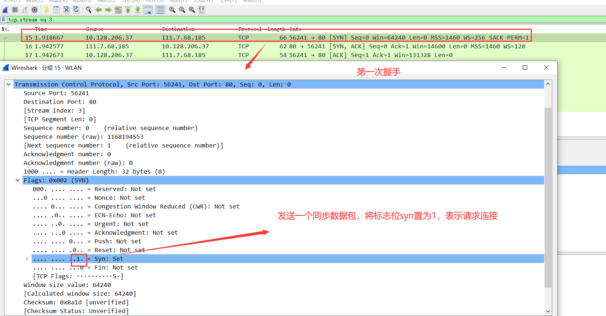

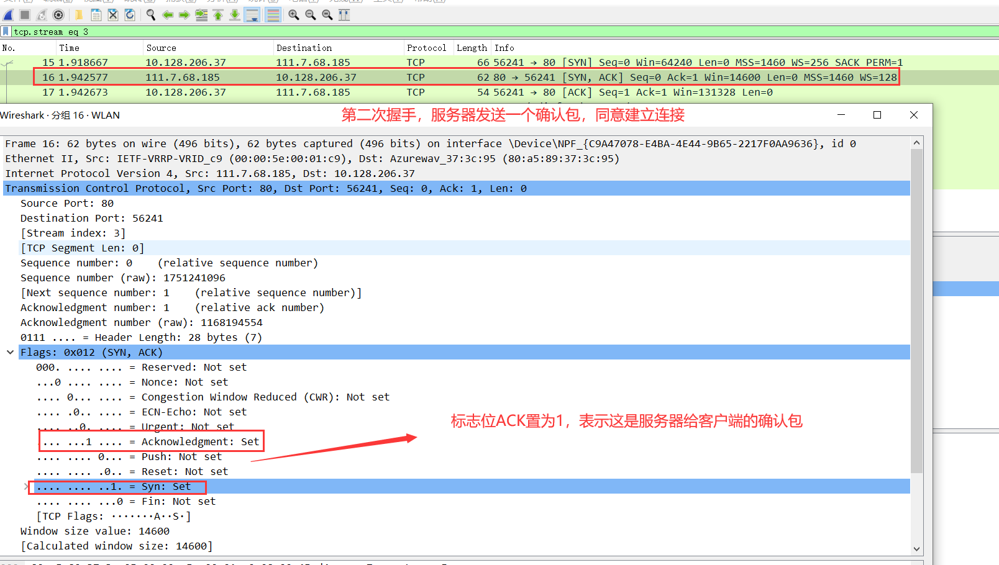

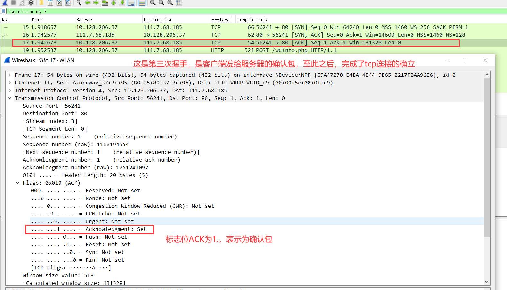

### TCP的连接释放(四次挥手)
    1. 实现:
        当A给B发送要求释放连接的数据包(FIN=1,seq=u)后,A就处于FIN-WAIT-1阶段,B给A发送确认消息(标志位ACK=1,ack
        确认号=u+1)后A就处于FIN-WAIT-2阶段,B就处于CLOSE-WAIT阶段,同时B会向A发送请求释放连接的消息(FIN=1,seq
        =w,ack=u+1),当B的数据发送完后,B就处于LAST-ACK阶段,之后，A就会给B一个确认消息(ACK=1,seq=u+1,ack=w+1),
        此时A进入TIME-WAIT阶段(最多等4分钟2MSL),如果都完成那么就完成关闭连接

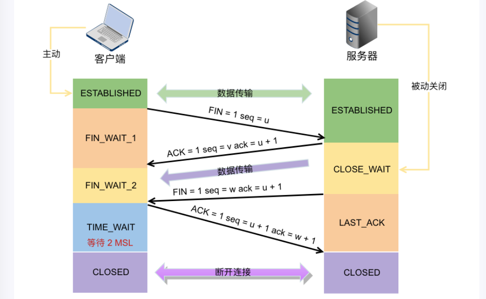

    2. TCP四次挥手抓包分析

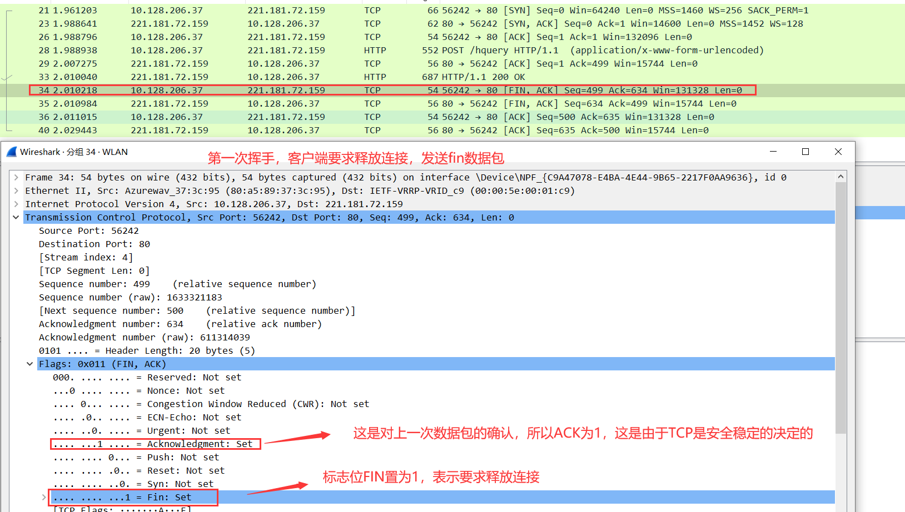

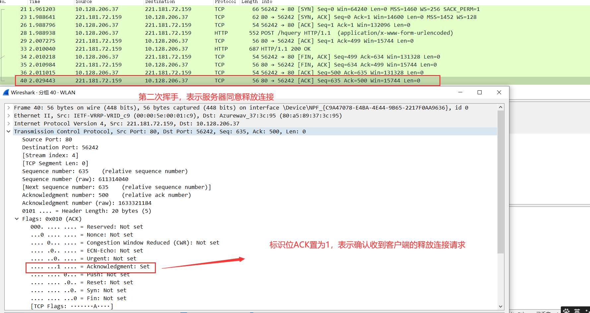

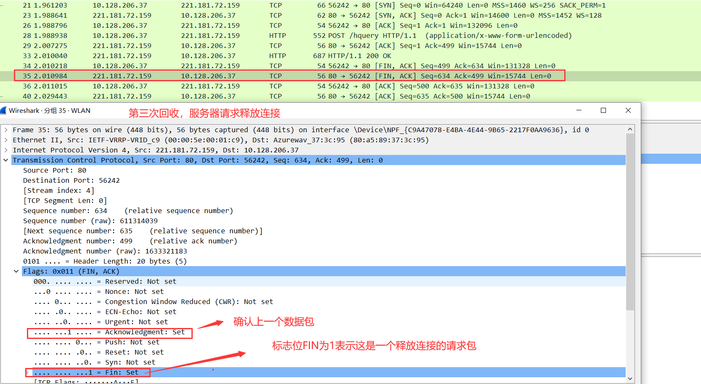

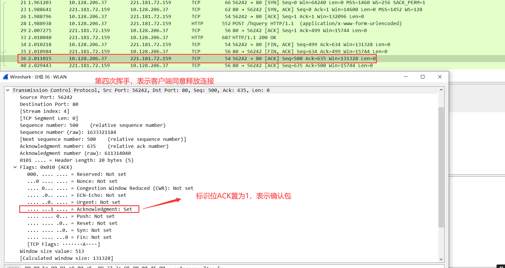

    