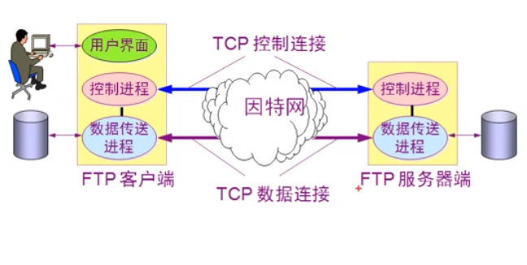
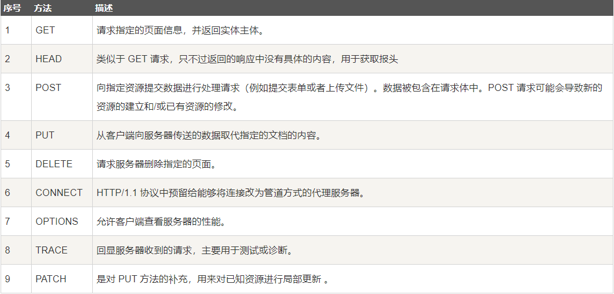
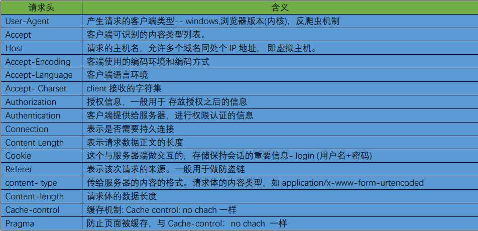
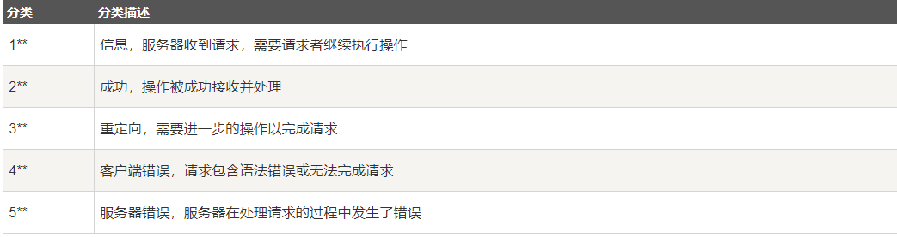
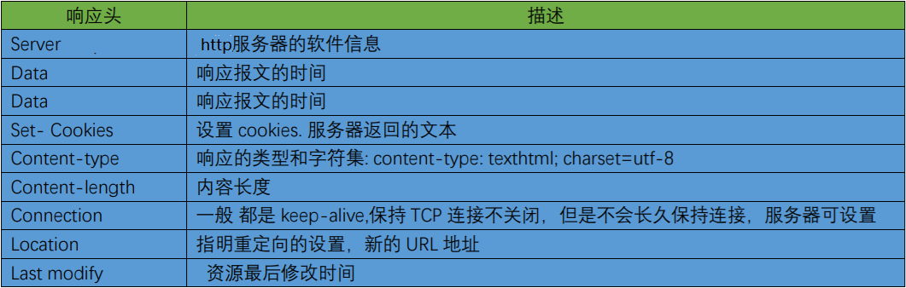
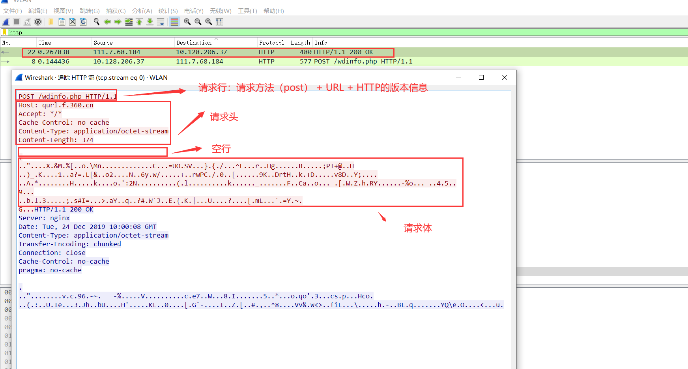
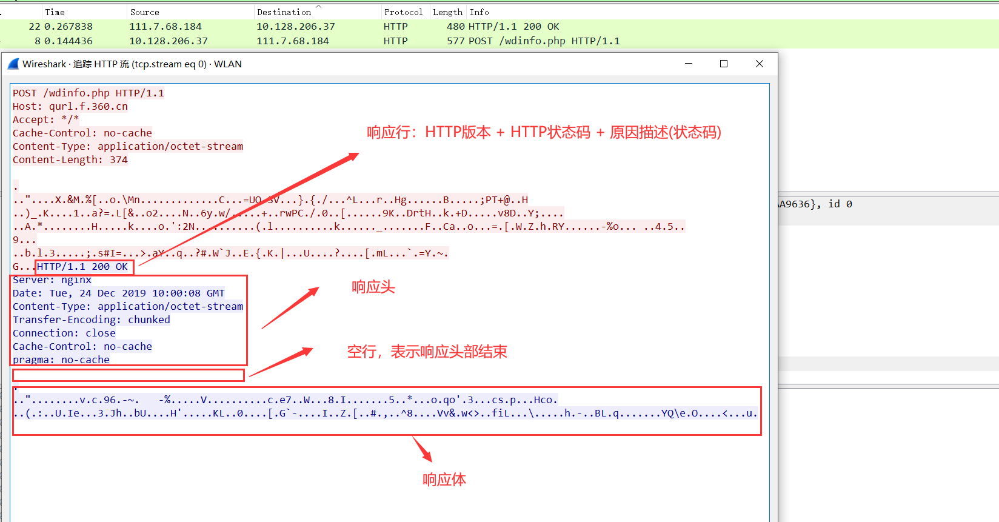

# 第六章

## DNS协议(域名系统)（重点）
    1. DNS的作用
        负责解析域名,将域名解析成IP地址

    2. 概念:
         <1> 域名:互联网上的网站或者服务器的名称就叫做域名,域名都是以点开始的,这就是根,然后就是顶级域名(com,edu,net,
                  cn,org,gow)。域名都是全球唯一的(二级域名先申请先得到,但是可以向他人购买)
            
            * 根:.

            * 顶级域名:
                com:具有商业性质
                edu:具有教育性质
                net:提供信息的服务器
                cn:代表是中国的
                org:代表组织
                gov:代表政府部门
                
            * 二级域名:(全球唯一)
                个人申请:如baidu,heima等
            * 三级域名:如:www.dba.baidu.com

            * 举例:假如www.baidu.com(万维网),mail.baidu.com(邮件服务器),ftp.baidu.com(ftp服务器) 也是说在baidu下
                    有三个服务器,而这三个服务器不需要再购买,我们只需要购买域名即可,加上了www或者mail或者ftp等,这个域
                    名就叫做完全限定域名(FQDN)
            
            * DNS服务器:8.8.8.8(谷歌公司的DNS服务器),222.222.222是电信公司DNS服务器

            * 域名解析:
                ping www.91xueit.com
                nslookup www.1xueit.com

    3.域名服务器：
        根域名服务器: 下面保存了各个顶级域名服务器的IP地址
        顶级域名服务器: 每一个顶级域名服务器都保存了其下的权限域名服务器的IP地址
        权限域名服务器: 如果是二级域名分成两个区, 则该每个区对应一个权限域名服务器(如a.com分成两个区
                      a.com和b.a.com)每一个区中保存了其底下的三级域名等的IP地址
        本地域名服务器：每一个网络服务提供商ISP, 每一个大学, 甚至大学里的一个系都会有一个本地域名服务器,
                      也叫默认域名服务器

    4. 域名解析的过程:
         Internet上的域名解析是分布式的技术(即有多个DNS解析)
            分布式实现:
            首先有一个根DNS服务器,它记录了其他DNS服务器的解析(如:专门解析com的DNS服务器,解析net的DNS服务器等等)
            在申请访问时,
            <1> 主机会先在自己的告诉缓存中查找是否存在需要被解析的域名, 如果存在, 则直接使用, 否则<2>
            <2> 主机会向本地域名服务器发送请求, 利用递归查询的方式, 让本地域名服务器给主机查找这个域名对应的IP
            <3> 本地域名服务器先查看自己的高速缓存中是否存在, 存在则返回, 不存在则利用迭代查询询问根域名服务器
            <4> 根域名服务器先查看自己的高速缓存中是否存在,存在则返回,否则告诉本地域名服务器去询问xxx顶级域名服务器
            <5> 本地域名服务器询问根域名服务器告知的顶级域名服务器, 顶级域名服务器先查看自己的高速缓存中是否存在, 
                存在则返回, 不存在则高速本地域名服务器去询问xxx权限域名服务器
            <6> 直到最后, 在一台权限域名服务器中如果找到了,则本地域名服务器再告诉主机是什么IP,如果没找到则返回错误

    5. 递归查询：本地域名服务器询问根域名服务器, 根域名服务器询问顶级域名服务器,顶级域名服务器询问权限域名服务器, 直
                到找到域名对应的IP地址, 然后沿着查找的路径返回

    6. 迭代查询：本地域名服务器询问根域名服务器, 根域名服务器会让本地域名服务器去询问一个顶级域名服务器, 然后本地域名
                服务器去询问顶级域名服务器, 顶级域名服务器会让本地域名服务器去询问一个权限域名服务器, 然后本地域名服
                务器去询问权限域名服务器, 依次类推, 直到找到域名对应的IP地址

    7. 高速缓存：对于已经访问的域名，该域名的IP地址会保存在本地域名服务器的高速缓存中, 同样的, 在其它域名服务器中也会
                存在已经访问过的域名的缓存。并且在主机也存在高速缓存, 有时候在开机的时候主机会从本地域名服务器中下载
                缓存的域名信息
    
    8. 什么时候需要自定义的DNS服务器
        1. 解析内网自己的域名
        2. 降低到Internet的域名解析流量
        3. 域环境

## DHCP(动态主机配置)
    1. 概述
        * 静态ip地址（计算机比较固定时，或者服务器，可以使用）
        * 动态ip地址
        * 注意：在IP配置中，如果使用自动获得地址就是动态地址，如果选择使用下面的地址（自定义的地址）则是静态地址

    2. DHCP客户端请求IP地址的过程
        * 网络中有多个DHCP服务器,当计算机设置为IP自动获得，这就变成了DHCP客户端，然后发送广播请求DHCP服务器，当服务器
         （多个） 收到请求后就会将IP地址给计算机，计算机会向其中一个服务器发送确认，选择使用，而其他的则收回，继续给其
          他计算机使用。
        
        * 注意：这是一个没有认证的过程，如果分配到错误的IP就不能正常使用。DHCP服务器必须使用静态地址
               使用DHCP获得IP地址后，释放IP地址：ipconfig release
               请求地址：ipcondig renew

    3. 跨网段地址分配
        不同网段的地址分配，需要在DHCP服务器上创建作用域，DHCP服务器本网段的计算机发送请求地址，服务器直接收到，而跨网
        段的计算机请求地址,则需要先通过路由器。配置DHCP中继代理时是在需要请求的计算机的路由器进行配置。
        （配置路由器：ip help-address ip地址）

## FTP（文件传输协议）
    1. 概述（FTP使用两个TCP连接）
        <1> FTP连接方式
            * 主动模式：FTP客户端告诉FTP服务器使用什么端口侦听，FTP服务器和FTP客户端的这个端口建立连接，源端口为20。
                        （服务端从20端口主动向客户端发起连接）       

                 * 注意：TCP控制连接使用的是TCP的21端口，用于发送命令（上传，下载等）。TCP数据连接使用的是TCP的20端口，
                         用于数据传输。

            * 被动模式：FTP服务器被动的打开一个端口，等待FTP客户端来连接。（服务端再指定范围内的某个端口被动等待客户端
                        发起连接）

        <2> FTP传输模式
            * 文本模式：ASCII模式，以文本序列传输数据
            * 二进制模式：Binary模式，以二进制序列传输数据

            * 主动模式下，防火墙需要打开20和21端口
            * 被动模式下，防火墙只打开20和21端口FTP不能下载数据（因为被动模式下，FTP服务器的等待连接端口是随意指定的）
            * 总而言之，FTP服务器端，如果有防火墙，需要在防火墙打开20和21端口，使用主动模式进行数据连接
    
    2. 如何在windows上安装FTP服务
        win10系统FTP服务器架设:
            <1> 控制面板 => 程序 => 启动或关闭windows功能 => Intenet Information Service=> 选中FTP服务器以及Web管理
                工具中的ISS管理控制台

            <2> 控制面板 => 系统和安全 => 管理工具 => Internet Information Services (IIS)管理器 => GOOT下的网站 => 
                添加FTP站点

            <3> windows防火墙 => 允许应用 => 选中FTP服务器 =>  在盘符下输入 C:\Windows\System32\svchost 或者
                ftp：//ftp的ip地址

            <4> 此时客户端即可连接, 如果客户端选择了FTP主动模式(IE浏览器=>Intenet选项=>高级=>不勾选被动FTP),那么客户端
                在连接FTP时会弹出防火墙已经阻止资源管理器打开FTP的功能(即用文件夹的方式打开不了), 此时应该选择允许, 如果
                忘记选了是登陆不上的, 需要在防火墙的允许应用通过中勾选Windows资源管理器

## telnet（远程终端协议）
    1.概述：
        端口默认使用23

        linux系统tenet连接使用：
            <1> telnet IP地址（前提能够ping通）
            <2> 登录路由器(输入用户名和密码) => show interface  
        
        windows系统tenet连接使用:
            <1> 启用telnet服务（在控制面板中个启动或关闭windows功能下）

        注意：
            cmd命令：<1> 重设密码 net user administrator 用户密码
                    <2> 添加用户 net user 用户名 用户密码 /add
                    <3> 将用户加入管理员组: net localgroup administrators 用户 /add
                    <4> 测试IP地址的端口是否打开： telnet IP地址 端口号

## RDP（远程桌面协议）
    1.概述
        * 服务：mstsc 使用TCP的3389端口
        * Server多用户操作系统，启用远程桌面可以多用户同时操作服务器
        * XP和windows7 单用户操作系统 不支持多用户同时操作
    
    2.如何将本地的硬盘映射到远程计算机
        * 在远程连接页面时，先通过选项将所需要映射的内容选中（可用于计算机之间拷贝文件等）

## HTTP协议（超文本传输协议）

### HTTP的综合
    1.概述
        * 万维网（world wide web）：之所以叫做万维网是因为访问网站时，可以通过统一资源定位符（URL）转到其他网站，网站
                                   之间相互连通。

        * 与万维网相关的概念：
            * 客户服务器方式（C/S）：
            * 客户程序
            * 浏览器：如谷歌浏览器等
            * 服务器程序：如windows2003（可以安装IIS服务：互联网信息服务）
            * 万维网服务器：运行网站的硬件
            * 页面：一个网站有多由多个页面组成
            * 统一资源定位符（URL）:
                    url的一般形式：<协议>://<主机>:<端口>/路径
                    网站的标识：可以使用不同的端口号区分，也可以使用不同的IP地址区分，使用域名区分（最佳方法，可以实现
                                一个服务器多个网站）
            * HTTP使用TCP连接
            * 超文本标记语言HTML
            * 搜索引擎
    2. 如何在计算机上安装web服务，创建web站点
        <1> 在控制面板 => 程序 => 启动和关闭windows服务 => 万维网服务
        <2> 系统和安全 => 管理工具 => 服务中查找
        <3> 系统和安全 => 管理工具 => IIS => 网站 => 添加网站

    3.使用web代理服务器访问网站
        1.节省内网访问Internet的带宽
        2.通过代理绕过防火墙
        3.通过Web代理可以绕过跟踪

### HTTP协议详解
    1. 概述
        <1> HTTP协议是基于TCP协议的，默认端口是80，是一个可靠的协议

        <2> 功能：规定客户端与服务端的数据传输格式

        <3> 特点：基于请求与响应模式的，无状态，无连接的应用层协议

    2. HTTP的请求与响应
        <1> HTTP的请求(由请求行，请求头，空行，请求体组成)
            1) 请求行(请求方法 + URL + 版本信息)
                * 请求方法如下所示

            2) 请求头(常见如下)

        <2> HTTP的响应(由响应行，响应头，空行，响应体组成)
            1) 响应行(HTTP版本 + HTTP状态码 + 原因(状态码))
                * 状态码如下所示

            2) 响应头(常见如下)

    3. 抓包分析HTTP
        <1> 请求报文分析

        <2> 响应报文分析

    4. 如何理解HTTP是一个无连接的应用层协议？
        <1> 限制了每次连接只处理一个请求，服务器处理完客户请求，并收到客户的应答后，就会断开连接

        <2> 这样设置的初衷：
            * 如果有大量用户请求页面，那么会导致单个用户的间歇大(突发性，瞬时性)，从而导致数据没有关联性，那么就会导
              致资源的浪费，所以就释放连接

            * 那么，这又导致一个问题：如果网页复杂，会导致请求响应效率低下，我们可以设置keep-alive解决

        <3> keep-alive的设置
            1) 开启：Connection:keep-alive,会发起keep-alive的连接请求--长连接。http1.1默认打开(不需要重新建立连接)

            2) 关闭：在响应头中设置Connection:close，即可关闭

            3) 设置连接时间
                在http的响应头中设置keep-alive:timeout=5,max=1000
                    * timeout是指超时时间，单位为秒，超过这个时间就断开连接
                    * max是最多连接次数，若超过次数就断开连接

    5. 如何理解HTTP是一个无状态的应用层协议
        <1> 对事务处理没有记忆能力，服务器不知道客户端是什么状态，给服务器发送http请求之后，服务器回应之后，不会有任何
            记录，每个请求都是独立的。

        <2> 那么，服务器在处理后续请求时，那么前面请求的信息可能需要重传。优点：释放服务器的压力。缺点：需要重传，增大
            数据量，浪费资源

        <3> 所以我们就需要使用Cookies和Session解决
            1) Cookies：将前面请求的信息保存成一个临时文件(Cookies值)，存放在浏览器中。只要关闭浏览器就会被清除

            2) Session：永久的Cookies值。保存在服务器上，传递给客户端，会保存在内存中

    6. HTTP协议存在问题
        * http发送的数据都是明文，可能导致请求或响应信息被篡改，监听等

## 电子邮件（SMTP，POP3,IMAP）
    1. 概述：
        * SMTP:简单邮件传输协议，用于发送电子邮件
        * POP3：用于接受电子邮件
        * IMAP:用于接受电子邮件

        * 邮件发送的过程
            首先邮件客户端（如foxmail）需要将邮件发送到邮件服务器（利用SMTP协议），然后服务器将邮件发送到接收方的邮件
            服务器的收件箱（利用SMTP协议），最后接收方再从自己的邮件服务器中接收邮件（利用POP3或者IMAP）

            注意：第一个发送过程的实现叫做邮件的中继。其中中继过程和接收邮件的过程都需要身份验证

