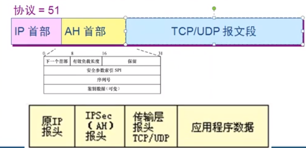
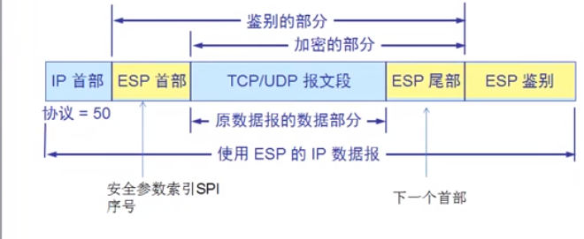

# 网络安全
    1.网络安全包括哪些方面
        * 数据存储安全
        * 应用程序安全
        * 操作系统安全
        * 网络安全
        * 物理安全
        
    
# 网络安全概述
    1.计算机面临的威胁
        * 截获：窃听通信内容，通过ARP欺骗实现
        * 中断：故意中断网络通信
            Dos攻击：A计算机不停的用大的数据报请求B计算机, 例如ping命令, 该攻击可以进行防范与阻挡
            分布式攻击 DDos：利用肉鸡来攻击指定的计算机。即A计算机通过控制大量的有漏洞的服务器不停的用大的数据报请求B计算机。只能增加带宽来解决。
        * 篡改：故意篡改网络上的报文
        * 伪造：伪造信息在网上传送

        * 截获信息攻击被称为被动攻击，更改信息和拒绝用户使用资源的攻击称为主动攻击
    
    2. 病毒和木马
        * 恶意程序
            <1> 计算机病毒：会“传染”其它程序的程序，“传染”是通过修改其他程序来把自身或其变种复制进去完成
            <2> 计算机蠕虫：通过网络的通信功能将自身从一个结点发送到另一个结点并启动运行程序
            <3> 特洛伊木马：一种程序，它执行的功能超出所声称的功能
            <4> 逻辑炸弹：一种运行环境满足特定的条件时执行其他特殊功能的程序
             
        * 如何查看电脑是否有木马程序
            1. 查看会话 netstat -n 是否有可以的会话
            2. 运行msconfig 服务 隐藏微软服务，查看是否有可疑服务
        
# 加密技术
    1.加密技术分类
        * 对称加密（加密密钥与解密密钥为同一个密钥）
            缺点：
                1. 不适合在网上传输，当两台计算机刚开始进行交互时，两者传递的密钥有可能被截获。
                2. 密钥的维护量很大（即要记住与多个用户交互的不同密钥）
            优点：
                1.执行加密效率高。
            数据加密的标准：DES
                首先，将整个明文进行分组，每个长度为64,的然后进行二进制加密处理，产生一组64位的密文，最后串接密文组成完整密文
                使用的密钥为64位，其中8位用于奇偶校验，密钥实际长度为56位。
                注意：DES算法,56位的密钥破解需要3.5到24分钟，128位的需要5.4 * 10的18次方年
        
        * 非对称加密
            1. 加密秘钥和解密密钥是不同的，是一个密钥对，分为公钥和私钥
                * 使用：
                    公钥加密，私钥解密
                    私钥加密，公钥解密
                * 特点：不能用私钥推出公钥，也不能用公钥推出私钥

                * 优点：在同一个相对的环境下，只要每个人有一对密钥，就能确保不会泄密

                * 缺点：效率低。

            2. 如何实现高效率下的非对称加密：
                AB两个计算机传送机密数据，B利用对称加密对需要传输的数据进行加密，然后再利用A的公钥对这个对称加密的密钥进行加密。
                A则利用自己的私钥对对称加密的密钥进行解密，获得对称加密的密钥，然后再利用对称加密的密钥解密数据。

            3. 数字签名：
                作用：
                    1. 防止抵赖
                    2. 能够检查签名之后内容是否被更改。
                如何实现：
                    A先对数据（合同）使用单向散列函数进行加密，得到128位的摘要（文件的“指纹”）然后利用A的私钥对摘要进行加密，
                    得到A的数字签名，然后将数据和A的数字签名以及A的公钥给B，B也使用散列函数对一份公开的数据（没有进过A处理的
                    合同）进行加密，得到摘要。然后B用A的公钥解密得到A加密的摘要，两者进行对比看摘要是否更改从而确定数据（合同）
                    是否更改。此时值得注意的是如何判断公钥的身份呢？那么就需要A先向证书颁发机构（CA）申请，然后CA会为A产生一个
                    数字证书（包含A的公钥和私钥，包含CA的私钥）然后CA会发证给A，B就会获得一个有CA签名的A的私钥，然后直接验证
                    A的公钥是否真实（通过CA验证，即查看A的公钥是否为CA颁发），最后利用A的公钥解密摘要。

                证书颁发机构的作用：
                    1. 为企业和用户颁发数字证书，确认这些企业和个人的身份
                    2. 发布证书吊销列表

# Internet上使用的安全协议
    1. 安全套接字SSL
        * 位置：在运输层和应用层之间

        * 作用：
                在发送方，SSL接收应用层的数据(如HTTP或IMAP报文)，对数据进行加密，然后把加了密的数据送往TCP套接字
                在接收方，SSL从TCP套接字读取数据，解密后把数据交给应用层

        * 功能：
            1. SSL服务器鉴别。允许用户证实服务器的身份。（通过CA的证书实现）
            2. 加密SSL会话。客户和服务器交互的所有数据都在发送方加密，在接收方解。如：https，pop3s等

                * http通过SSL如何实现HTTPS
                    当浏览器访问web服务器时，web服务器会把自己的公钥给浏览器，此时浏览器会产生对称密钥（abc），并且使用web的公钥对对称密钥进行加密
                    然后发送给web服务器，web服务器用自己的私钥解密得到密钥（abc）然后使用abc进行数据解密，之后它们交互都通过该密钥（abc）进行解密。
                   
                    注意：此处是先使用对称加密然后使用非对称加密，这样既提高效率有提高安全性。

                * 使用SSL之后的其他协议
                    imaps：tcp-993端口
                    pop3s：tcp-995端口
                    smtps：tcp-465端口 

            3. SSL客户鉴别。允许服务器证实客户的身份。（通过CA的证书实现）

    2. 网络层安全IPSec（点到点之间的安全）
        * 概念：把传统的因特网无连接的网络层转换为具有逻辑连接的层，逻辑连接叫做安全关联（SA）

        * IPSec中主要的两个协议
            1. 鉴别首部AH：AH鉴别源点和检查数据完整性，但不能保密。

                在使用AH协议时，会把AH的首部插在元数据报数据部分的前面，同时把IP首部的协议字段改为51，在传输过程中，中间的路由器不查看
                AH的首部，但数据包完整到达终点时，目的主机才会处理AH字段，鉴别源点和检查数据报的完整性。

            2. 封装安全有效载荷ESP：ESP比AH复杂的多，它鉴别源点，检查数据完整性和提供保密。
                
                在使用ESP协议时，IP数据报首部协议字段改为50，当IP首部检查到协议字段为50时，就知道在它后面是ESP的首部，同时会在原IP数据报
                后面增加两个字段，即ESP尾部和ESP数据。

    3. 数据链路层安全（通过链路设备实现）
        * 实现：可以通过路由器之间的不断加密和解密来实现数据链路层的安全。

        * 数据链路层身份验证 PPP协议 身份验证
        * ADSL拨号 数据链路层安全
    
    4. 防火墙实现的安全
        
        * 防火墙内的网络为“可信赖的网络”，而外部的因特网为“不可信赖的网络”，通过防火墙可以解决内联网和外联网的安全问题。

        * 分类
            1. 网络级防火墙：
                用于防止整个网络出现外来非法的入侵。可以检查数据包(基于数据包 源地址 目标地址 协议和端口控制流量 )
            2. 应用级防火墙
                从应用程序来进行接入控制，通常使用应用网关或代理服务器来去区分各种应用。
                (基于数据包 源地址 目标地址 协议和端口 用户名 时间段 内容 防病毒进入内网)
        
        * 防火墙的拓扑结构
            三向外围网
            背靠背防火墙
            单一网卡防火墙
            边缘防火墙

    

